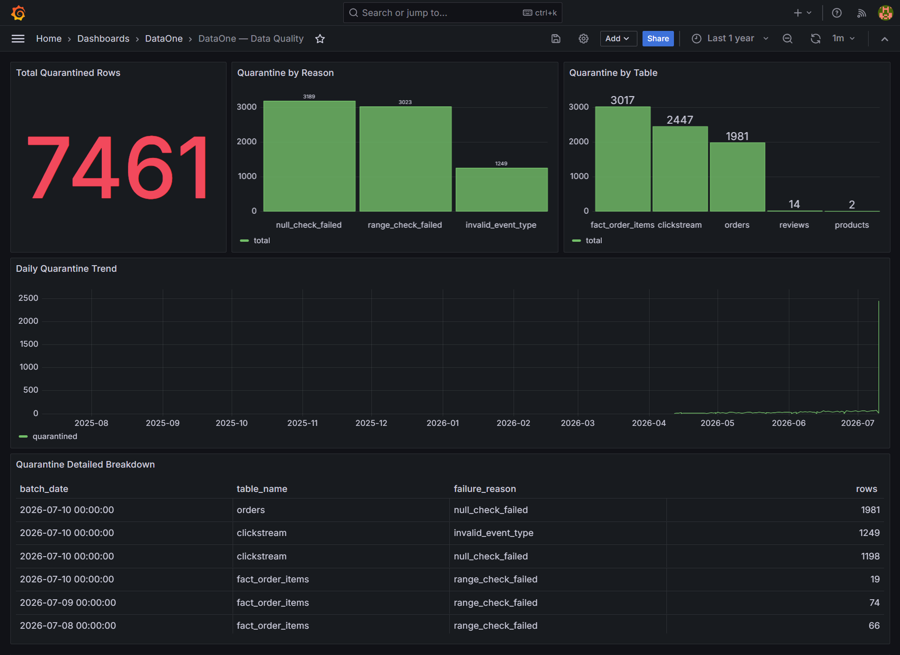

# Grafana Dashboards Guide

The DataOne Lakehouse serves its Gold-layer marts directly into ClickHouse, enabling highly performant reporting via Grafana. Below are snapshots of the key dashboards and an explanation of their individual panels.

## 📈 Business KPIs Dashboard
Provides a high-level view of daily sales, revenue averages, funnel conversion rates, and top products.

### Panel Breakdown & Business Value

| Panel Name | Description | Business Value |
|---|---|---|
| **Daily Revenue (7d / 30d)** | Tracks the gross daily income against rolling averages. | Helps executives spot immediate revenue dips or growth trends against historical baselines. |
| **Top 5 Products by Revenue** | Highlights the highest-grossing items across different departments. | Directs inventory and marketing focus toward top performers. |
| **Customer Segments** | Breaks down the active customer base into marketing classifications. | Enables targeted CRM and personalized marketing campaigns. |
| **Sessions vs Checkout** | Compares the number of users hitting the site against those finishing a purchase. | Identifies drop-off rates and friction in the e-commerce funnel. |
| **Conversion Rate** | The definitive percentage of sessions that end in a sale. | The ultimate metric for overall website and product-market-fit health. |
| **Campaign Effectiveness** | Maps specific marketing campaigns against their conversion yields. | Determines which marketing channels are actually driving sales. |
| **Live Activity Pulse** | Real-time ticker of user actions (from the clickstream topic). | Crucial for operations during high-traffic events to ensure the site is active. |
| **Product Sentiment** | Analyzes NLP scores on user reviews. | Provides immediate feedback on product quality or shipping issues directly from consumers. |
| **Return on Ad Spend (ROAS)** | Calculates revenue generated per marketing dollar spent. | Guides budget allocation for future ad campaigns. |
| **Customer Lifetime Value** | Ranks customers by total historical spend. | Identifies "whales" for loyalty programs and exclusive outreach. |
| **Funnel Conversion Rates** | A step-by-step breakdown (Page View -> Add to Cart -> Checkout). | Pinpoints the exact UI/UX stage where users abandon their carts. |

---

## ⚙️ Ops Operations Overview
Monitors system health, ingestion rates, and infrastructure metrics.

### Panel Breakdown & Business Value

| Panel Name | Description | Business Value |
|---|---|---|
| **Container CPU & Memory** | Hardware utilization across the Docker swarm. | Prevents out-of-memory crashes and guides scaling decisions. |
| **Postgres Active Connections** | Tracks DB pool exhaustion. | Protects the OLTP database from being overwhelmed by extraction or ingestions. |
| **ClickHouse Query Rate** | Measures analytical load on the serving layer. | Ensures dashboard responsiveness during peak usage. |
| **Kafka Brokers & Partitions** | Health of the message bus. | Guarantees no streaming data is lost or severely bottlenecked in transit. |
| **Postgres / Spark Up** | Uptime heartbeat checks. | Triggers immediate alerts if core ingestion or processing engines go offline. |

---

## 🛡️ Data Quality Dashboard
Tracks the PySpark Data Quality Gate metrics, including rows passed vs. quarantined and the distribution of failure reasons.

### Panel Breakdown & Business Value

| Panel Name | Description | Business Value |
|---|---|---|
| **Total Quarantined Rows** | Raw count of records that failed the validation gate. | Immediately highlights systemic data corruption or schema drifts upstream. |
| **Quarantine by Reason** | Categorizes failures (e.g., `null_check_failed`). | Points data engineers directly to the root cause. |
| **Quarantine by Table** | Shows which datasets (Orders, Reviews) are producing errors. | Prioritizes data engineering triage efforts. |
| **Daily Quarantine Trend** | Plots error rates over time, grouped by individual table. | Detects if data quality is improving or deteriorating after recent code deployments, pinpointing exactly which table spiked. |
| **Quarantine Detailed Breakdown** | A comprehensive data table combining batch date, table name, failure reason, and row count. | Allows engineers to easily scan, sort, and drill down into the exact cause of a specific spike on a given day. |

---

## ⏱️ Realtime Operations Dashboard
Monitors real-time operational data, specifically focusing on up-to-the-minute activity.

### Panel Breakdown & Business Value

| Panel Name | Description | Business Value |
|---|---|---|
| **Orders Last 5 Min** | The raw count of orders placed in the last 5 minutes. | Immediate visibility into sudden spikes or drops in order volume. |
| **Order Status Breakdown (Live)** | A pie chart displaying current live orders by status (Pending, Shipped, etc). | Helps logistics teams balance fulfillment workloads. |
| **Estimated Revenue (Last Hour)** | Real-time calculation of revenue over the last 60 minutes. | Tracks intra-day financial performance during high-traffic events. |
| **Order Velocity (Live)** | A time-series chart showing the rate of orders per minute. | Detects anomalies in buying patterns in real-time. |
| **Sessions + Checkouts (Live Pulse)** | Combines clickstream activity with checkout events. | Highlights real-time friction if traffic is high but checkouts are low. |
| **Stale Orders Alert (Placed > 30m)** | Highlights orders that have been pending for too long. | Triggers customer support or fulfillment escalation. |
| **Batch vs Real-Time Extrapolation** | Compares historical batch data vs real-time estimates. | Helps forecast expected end-of-day metrics based on current live trajectories. |

> **Note on Time Accuracy:** The Realtime Operations Dashboard correctly buckets orders by their true business timestamp (`order_date`), not their ingestion or capture time (`captured_at`). This ensures that projections and velocity charts remain 100% accurate and immune to artificial spikes even if historical data is being backfilled into the CDC pipeline.

