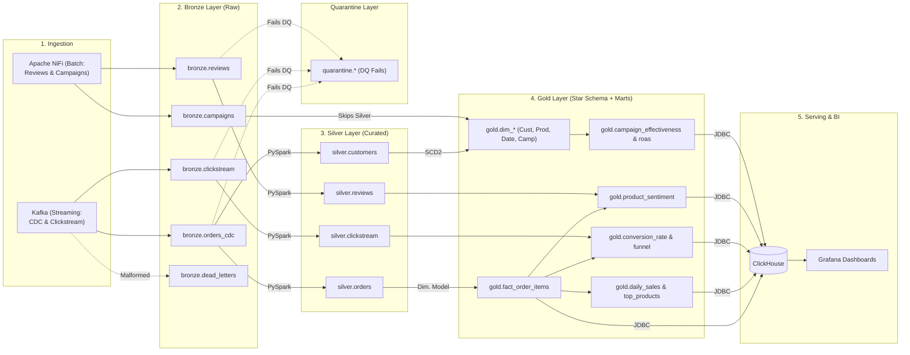
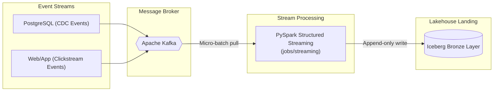
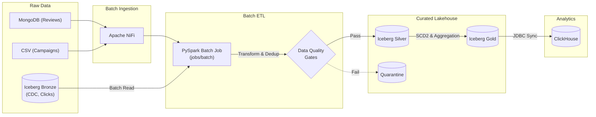

# Data Modeling Architecture

This document serves as the single source of truth for the data modeling architecture, methodologies, and engineering rationale applied within the DataOne project. All definitions map natively to the codebase schemas defined in `src/dataone/utils/schemas.py`.

---

## 1. Executive Architecture & Paradigm Overview

**Paradigm:** The project employs a **Medallion Architecture** (Bronze, Silver, Gold) with a **Kimball Dimensional Modeling** approach fully consolidated at the Gold (presentation) layer. It also utilizes a specialized **Quarantine Layer** for strict Data Quality isolation.

### Conceptual Data Flow

---

### Execution Pipelines (Streaming vs Batch)

While the conceptual diagram shows the *logical* flow of data, the physical execution is decoupled into two separate pipeline patterns:

#### 1. Streaming Pipeline (Landing)
Designed purely for high-throughput, low-latency ingestion. It performs zero transformations or joins, simply dumping raw Kafka events into the Bronze Lakehouse as quickly as possible.

.png)

#### 2. Batch Pipeline (ETL & Curation)
Runs on a scheduled cadence (e.g., hourly/daily). It is responsible for all heavy lifting: parsing CDC JSON, enforcing Data Quality, maintaining SCD Type 2 dimensions, aggregating Gold marts, and syncing to the ClickHouse serving layer.

.png)

---

## 2. Detailed Schema & Entity Breakdown

### 🥉 Bronze Layer (Raw / Append-Only)
Designed to ingest data as close to the source shape as practical.

- **`bronze.orders_cdc`**: 
  - **Function:** Ingests Change Data Capture (CDC) events emitted from the PostgreSQL database.
  - **Modeling Approach:** *Schema-on-Read*. Because the CDC simulator captures events from multiple heavily-differing tables (`orders`, `customers`) into one topic, the payload is stored as raw JSON in `data_json` to avoid forcing a sparsely-populated, incredibly wide union schema.
- **`bronze.clickstream`, `bronze.reviews`, `bronze.campaigns`**:
  - **Function:** Event and batch ingestion targets.
  - **Modeling Approach:** Typed flat schemas natively matching the upstream event shape.

- **`bronze.dead_letters`**:
  - **Function:** Safely stores any unparseable or completely malformed raw Kafka events.
  - **Modeling Approach:** Schema-on-Read, capturing the raw string value and source topic for later debugging.

### 🥈 Silver Layer (Curated / Cleansed 3NF)
Designed to deduplicate, normalize, and enforce data quality. Contains **only cleansed entities** — the Kimball Star Schema lives entirely in Gold.

- **`silver.customers`**:
  - **Function:** Curated latest-state of customers parsed from Bronze CDC.
  - **Keys:** PK: `customer_id`.
  - **Grain:** One row per customer.

- **`silver.orders`**:
  - **Function:** Curated and deduplicated orders parsed from Bronze CDC.
  - **Keys:** PK: `order_id`. FKs: `customer_id`, `campaign_id`.
  - **Grain:** One row per order.

- **`silver.reviews`**:
  - **Function:** Curated product reviews with enriched NLP `sentiment_score`.
  - **Keys:** PK: `review_id`. FKs: `product_id`, `customer_id`.
  - **Grain:** One row per unique product review.

- **`silver.clickstream`**:
  - **Function:** Curated and validated behavioral click events.
  - **Keys:** PK: `event_id`. FKs: `session_id`, `product_id`, `customer_id`.
  - **Grain:** One row per discrete user action.

### 🥇 Gold Layer (Star Schema + Aggregated Marts)
Contains the complete Kimball Star Schema and all pre-aggregated business marts. This is the **single presentation layer** for all analytical consumption.

#### Fact Table

- **`gold.fact_order_items`**:
  - **Function:** Core transactional fact recording completed sales.
  - **Keys:** PK: `sk_order_id` (SHA-256 surrogate). FKs: `sk_product_id`, `sk_campaign_id`, `date_key` (INT), `customer_id`.
  - **Grain:** One row per discrete order line item sold.
  - **Surrogate Keys:** Every conformed dimension is joinable via deterministic hash SKs, isolating the analytics layer from upstream key changes.

#### Conformed Dimensions

- **`gold.dim_customer`** (SCD Type 2):
  - **Function:** Tracks historical and current customer demographic information.
  - **Keys:** PK: `sk_customer_id` (SHA-256 surrogate). Business Key: `customer_id`.
  - **Grain:** One row per customer per distinct period of state (tracked via `valid_from`, `valid_to`, and `is_current`).

- **`gold.dim_date`**:
  - **Keys:** PK: `date_key` (integer, format `YYYYMMDD`). `calendar_date` (DATE) retained for human-readable queries.
  - **Grain:** One row per calendar day.

- **`gold.dim_product`**:
  - **Keys:** PK: `sk_product_id` (SHA-256 surrogate). Business Key: `product_id`.
  - **Grain:** One row per product.

- **`gold.dim_campaign`**:
  - **Keys:** PK: `sk_campaign_id` (SHA-256 surrogate). Business Key: `campaign_id`.
  - **Grain:** One row per marketing campaign.

#### Aggregated Business Marts (Wide-Table / OBT approach)

- **`gold.daily_sales`**: Aggregates `fact_order_items` by day. Calculates 7-day and 30-day rolling revenue averages.
- **`gold.conversion_rate`**: Joins `fact_order_items` against `bronze.clickstream` to track checkout completion efficiency.
- **`gold.customer_clv`**: Customer Lifetime Value aggregating historical spend and total orders.
- **`gold.product_sentiment`**: Blends `silver.reviews` and `fact_order_items` to derive average product ratings and NLP sentiment.
- **`gold.top_products`**: RANK() per category by revenue.
- **`gold.customer_segments`**: Revenue and engagement metrics by demographic segment.
- **`gold.funnel_conversion`**: Full checkout funnel (page_view → add_to_cart → checkout_start → checkout_complete).
- **`gold.roas`**: Return On Ad Spend per campaign.
- **`gold.quarantine_summary`**: Aggregates daily failure counts by table and reason for Data Quality monitoring.
- **`gold.quality_gate_summary`**: Aggregates daily passed and quarantined counts across tables to calculate true data quality rates.

### 🚨 Quarantine Layer
- **`quarantine.*` (e.g., `fact_order_items`, `customers`, `reviews`)**: 
  - **Function:** Mirrors the exact schema of its corresponding Silver/Gold table but captures rows that fail the PySpark Data Quality gate (e.g., negative quantities, missing emails).
  - **Addition:** Appends a `_quarantine_reason` column for engineering triage.

---

## 3. Design Rationale & Trade-offs

1. **Schema-on-Read vs. Schema-on-Write (Bronze CDC):** 
   By keeping the CDC payload as JSON in `bronze.orders_cdc`, we prioritize write-performance and absolute resilience against upstream schema evolution. The trade-off is higher compute costs during the batch ETL job, which must parse the JSON at scale.
2. **Pre-Aggregation (Gold Marts):** 
   Instead of forcing the BI tool (Grafana) or the Serving DB (ClickHouse) to compute real-time averages from massive fact tables, we deliberately pre-aggregate metrics like `daily_sales` and `conversion_rate` into the Gold layer. This sacrifices maximum analytical flexibility (drill-down capabilities) to optimize for lighting-fast read-performance and minimal serving compute costs. However, `fact_order_items` is also synced to ClickHouse alongside the aggregates, enabling analysts to run ad-hoc Star Schema queries (e.g., revenue by product category for a specific campaign) without requiring new pipeline work.
3. **Surrogate Key Strategy:**
   All dimension-to-fact joins use deterministic SHA-256 hash surrogate keys (`make_surrogate_key()`). This isolates the analytics layer from upstream primary key recycling or data type changes, and supports future multi-source-system integration without key collisions.

---

## 4. Performance Optimization Strategies

The following physical optimizations are built into the PySpark Iceberg DDLs (`schemas.py`):

1. **Partitioning (Time-based Data Pruning):** 
   - `gold.fact_order_items` is partitioned by `days(order_date)`.
   - `silver.reviews` is partitioned by `months(submitted_at)`.
   - *Mechanic:* Enables query engines to ignore entirely irrelevant directories when querying a specific date range, drastically reducing I/O.
2. **Bucketing (Join Optimization):** 
   - Both `gold.dim_customer` and `gold.fact_order_items` are bucketed by `bucket(16, customer_id)`.
   - *Mechanic:* Co-locates data for the same `customer_id` into identical bucket files. This eliminates expensive network shuffles (Broadcast/Shuffle-Hash Joins) when PySpark executes the heavy `dim_customer` vs `fact_order_items` joins.
3. **Integer Date Keys:**
   - `gold.dim_date` uses an `INT` primary key (format `YYYYMMDD`) instead of a `DATE` type. This enables ultra-fast integer hash joins between `fact_order_items.date_key` and `dim_date.date_key`, avoiding runtime `to_date()` casting.

---

## 5. Slowly Changing Dimensions (SCD) & History Handling

The `gold.dim_customer` implements **SCD Type 2**.
- When a customer's address or segment changes in Postgres, a new CDC event is fired.
- The `scd2_customer_dim.py` PySpark job utilizes Apache Iceberg's native `MERGE INTO` SQL syntax.
- The old record is expired (`valid_to = current_timestamp()`, `is_current = False`), and a brand new record is inserted (`valid_from = current_timestamp()`, `is_current = True`).
- This ensures historical `fact_order_items` are tied to the demographic state of the customer *at the exact time the order was placed*.

---

*Created by **Eng. Ahmed Maher Al-Maqtari***  
*Copyright © Mr.NumberOne*
