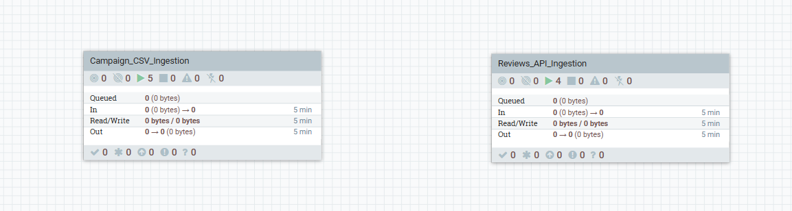
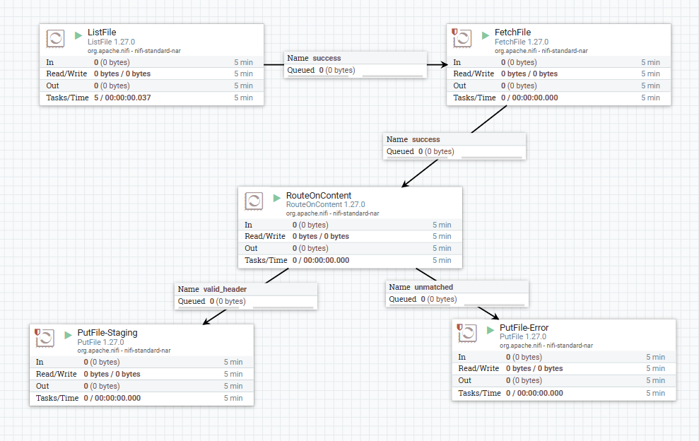
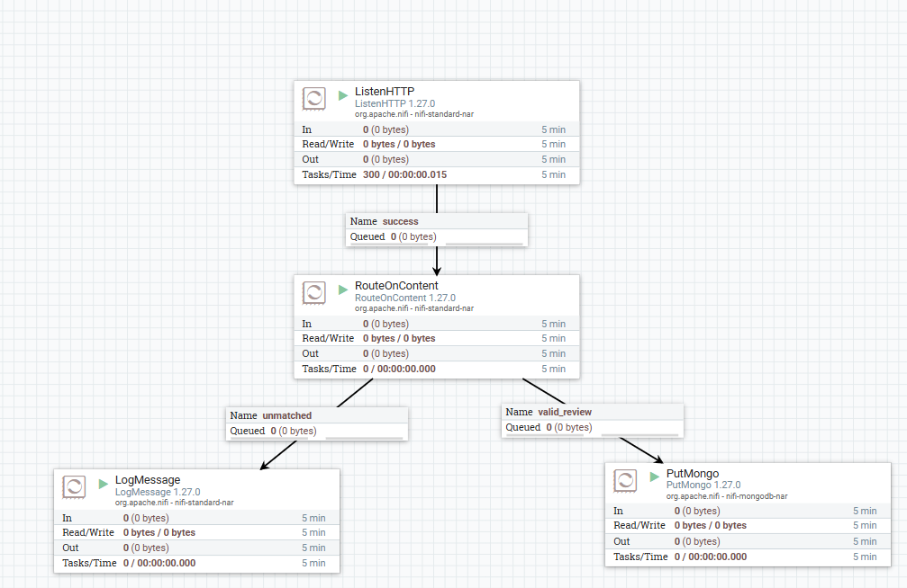

# NiFi Flows Guide

Apache NiFi is used in DataOne to orchestrate external ingestions into the staging area before PySpark picks them up.

## 🔀 Process Groups Overview
The high-level NiFi canvas groups workflows into logical domains.

## 📝 Campaign CSV Ingestion
This flow listens for incoming static CSV files containing marketing campaigns, standardizes them, and drops them into the lakehouse staging volume.

## 🌐 REST API Ingestion to MongoDB
This flow provides a plain-HTTP `ListenHTTP` endpoint for ingesting product reviews, processing the JSON payloads, and landing them into MongoDB for the subsequent batch ETL extraction.

