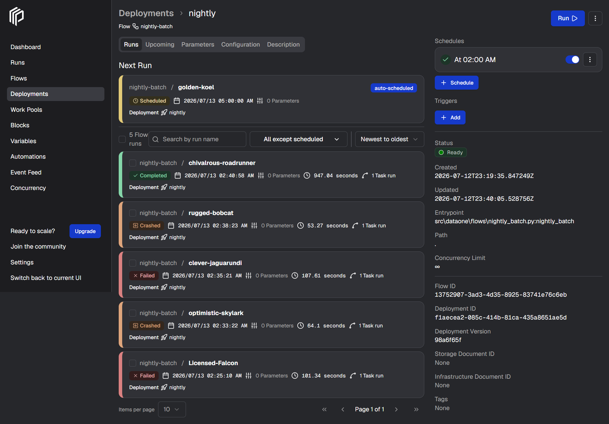
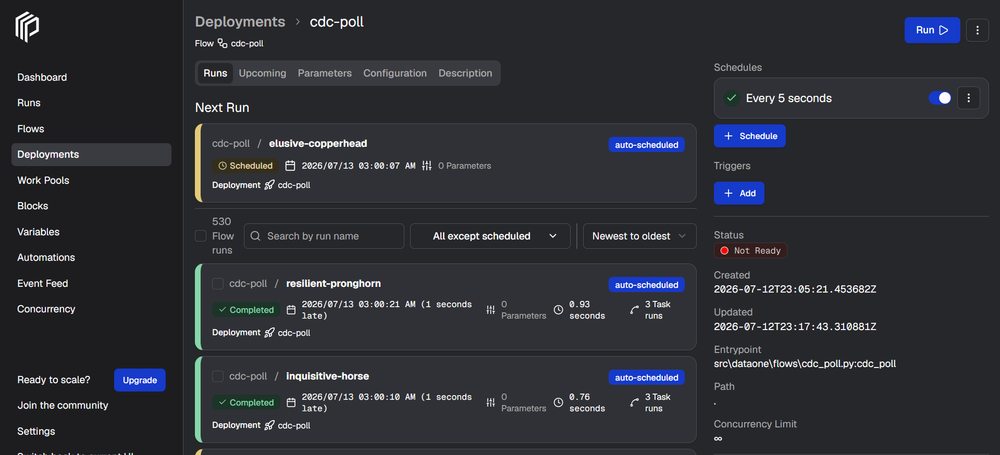

# Orchestration Guide (Prefect)

DataOne uses **Prefect 3.x** to orchestrate its core batch and interval-based pipelines. This replaces the legacy custom-built Python scheduler with a robust, production-grade orchestration tool without sacrificing the lightweight, local-first footprint required by this project.

---

## Why Prefect?

While Airflow and Dagster are also industry standards, Prefect was specifically chosen for this local laptop-scale environment because it offered the lowest friction for our architecture:
1. **Python-Native:** Prefect decorators (`@flow` and `@task`) map perfectly to our existing Python codebase. We did not need to adopt a rigid new DAG authoring paradigm.
2. **Resource Efficiency:** Prefect runs entirely out of our existing PostgreSQL metadata database (in a dedicated `prefect` logical DB) and reuses our existing Spark Docker image (`dataone-spark`) for its worker pool. This avoids the heavy footprint of running multiple JVMs, Celery workers, or separate Airflow webservers just for orchestration.
3. **Observability:** Prefect provides an out-of-the-box UI for tracking flow states, retries, and logs with zero extra configuration.

---

## Architecture & Infrastructure

Prefect runs via three dedicated services in the `core` profile of our `docker-compose.yml`:

- `prefect-server`: The core API and UI server, available at `http://localhost:4200`.
- `prefect-redis`: The messaging layer required by Prefect 3.x for event routing.
- `prefect-worker`: The worker process. It shares the exact same Docker image as `spark-worker-batch` (`x-spark-image`) so that our flows have immediate access to `spark-submit`, PySpark, and all Iceberg JDBC jars without any dependency conflicts.

---

## The Flows

The orchestration logic is located in `src/dataone/orchestration/`. We currently maintain two core flows:

### 1. Nightly Batch Pipeline (`nightly_batch.py`)



- **Trigger:** Runs via a Cron schedule (`0 2 * * *` - 02:00 AM daily).
- **Task:** Orchestrates the Medallion architecture batch job (`bronze_to_silver.py`).
- **Features:** It includes task-level retry policies (`retries=3`) with exponential backoffs in case the Spark master is temporarily unreachable or experiences transient failures. It also accepts `start` and `end` parameters for backfills.

### 2. CDC Simulator Poller (`cdc_poll.py`)



- **Trigger:** Runs on a 30-second interval schedule.
- **Task:** Repeatedly executes the `poll_once` function on our PostgreSQL tables (`customers` and `orders`) to detect changes and emit events into Kafka.
- **Features:** Provides high observability. If a specific poll cycle fails (e.g., due to a temporary DB lock), Prefect natively retries the task, and we can easily see exactly which interval failed rather than having a monolithic daemon crash silently.

---

## Execution & Usage

Because Prefect runs inside Docker, the `make` targets on your host simply serve the flows natively. Make sure that your `.env` contains the correct `PREFECT_API_URL` (usually `http://localhost:4200/api`) so the local Python script can communicate with the Dockerized server.

**Starting the nightly scheduler:**
```bash
make schedule
```

**Starting the CDC poller:**
```bash
make stream-cdc
```

**UI Dashboard:**
Navigate to `http://localhost:4200` to monitor runs, view task-level logs, configure deployments, and inspect pipeline health visually.
