# DataOne Architecture Workflow

## Overview

The **DataOne** platform is a modern, production-grade enterprise Data Lakehouse platform built on a hybrid **Lambda Architecture** and **Medallion Architecture**. It integrates real-time event streaming and high-volume batch workloads, utilizing a unified storage layout in **Apache Iceberg**, a high-performance OLAP serving layer in **ClickHouse**, and end-to-end data lineage, orchestration, and system observability.

The core purpose of the platform is to process operational e-commerce data (customers, orders, products, order items), marketing campaigns, user clickstream events, and product reviews, transforming raw ingestion inputs into clean, conformed business intelligence datasets.

### Big-Picture Architecture Overview

The following high-level diagram represents the overall data lifecycle, showing how the core tools orchestrate data progression through the Medallion layers:

```mermaid
flowchart LR
    %% Styling Class Definitions
    classDef source fill:#f9f9f9,stroke:#333,stroke-width:1px;
    classDef ingest fill:#eef,stroke:#006,stroke-width:1px;
    classDef bronze fill:#d5e8d4,stroke:#82b366,stroke-width:1px;
    classDef silver fill:#fff2cc,stroke:#d6b656,stroke-width:1px;
    classDef gold fill:#e1d5e7,stroke:#9673a6,stroke-width:1px;
    classDef serving fill:#f5f5f5,stroke:#666,stroke-width:1px;
    classDef lineage fill:#fff2cc,stroke:#ff6f00,stroke-width:1px;

    subgraph SOURCES ["Data Sources"]
        PG["<img src='https://cdn.jsdelivr.net/gh/devicons/devicon@latest/icons/postgresql/postgresql-original.svg' width='40'/><br/><b>PostgreSQL OLTP</b>"]:::source
        MG["<img src='https://cdn.jsdelivr.net/gh/devicons/devicon@latest/icons/mongodb/mongodb-original.svg' width='40'/><br/><b>MongoDB Reviews</b>"]:::source
        CSV["<b>Campaign CSVs</b><br/>Batch Files"]:::source
        CS["<b>Clickstream Client</b><br/>Web Events"]:::source
    end

    subgraph INGEST ["Ingestion & Broker"]
        NIFI["<img src='https://nifi.apache.org/assets/images/nifi-logo.svg' width='40'/><br/><b>Apache NiFi</b>"]:::ingest
        CDC["<img src='https://cdn.jsdelivr.net/gh/devicons/devicon@latest/icons/python/python-original.svg' width='40'/><br/><b>CDC Poll</b>"]:::ingest
        KAFKA["<img src='https://cdn.jsdelivr.net/gh/devicons/devicon@latest/icons/kafka/kafka-original.svg' width='40'/><br/><b>Apache Kafka</b>"]:::ingest
    end

    subgraph BRONZE ["Bronze Layer (Raw)"]
        B_TABLES["<img src='https://upload.wikimedia.org/wikipedia/commons/e/e4/Apache_Iceberg_Logo.svg' width='40'/><br/><b>Bronze Layer</b><br/>Raw Tables & DLQ"]:::bronze
    end

    subgraph SILVER ["Silver Layer (Cleaned)"]
        S_TABLES["<img src='https://upload.wikimedia.org/wikipedia/commons/e/e4/Apache_Iceberg_Logo.svg' width='40'/><br/><b>Silver Layer</b><br/>Cleaned & Scored"]:::silver
    end

    subgraph GOLD ["Gold Layer (Marts)"]
        G_STAR["<img src='https://upload.wikimedia.org/wikipedia/commons/e/e4/Apache_Iceberg_Logo.svg' width='40'/><br/><b>Gold Layer</b><br/>Star Schema & Marts"]:::gold
    end

    subgraph SERVING ["Serving & Analytics"]
        CH["<img src='https://cdn.jsdelivr.net/gh/devicons/devicon@latest/icons/clickhouse/clickhouse-original.svg' width='40'/><br/><b>ClickHouse OLAP</b>"]:::serving
        GRAFANA["<img src='https://cdn.jsdelivr.net/gh/devicons/devicon@latest/icons/grafana/grafana-original.svg' width='40'/><br/><b>Grafana UI</b>"]:::serving
    end

    %% Flows
    PG -->|CDC Poll| KAFKA
    CS -->|Direct Stream| KAFKA
    CSV -->|NiFi Ingestion| B_TABLES
    MG -->|Spark Batch Ingest| B_TABLES
    
    KAFKA -->|Spark Streaming| B_TABLES

    B_TABLES -->|Spark Standardize + DQ Validation| SILVER
    SILVER -->|SCD2 Customer Merge + Kimball Star Join| GOLD

    GOLD -->|Truncate & Load Staging + Table Exchange| CH
    CH -->|OLAP Queries| GRAFANA

    %% Cross-cutting
    subgraph ORCH ["Orchestration & Lineage"]
        PREFECT["<img src='https://raw.githubusercontent.com/PrefectHQ/prefect/main/docs/img/logo-color-on-dark.png' width='40'/><br/><b>Prefect Orchestration</b>"]:::lineage
        MARQUEZ["<img src='https://raw.githubusercontent.com/MarquezProject/marquez/main/marquez.png' width='40'/><br/><b>Marquez Lineage</b>"]:::lineage
    end

    PREFECT -.->|Schedules & Runs Tasks| INGEST
    PREFECT -.->|Schedules Spark Tasks| B_TABLES
    B_TABLES -.->|OpenLineage Run Events| MARQUEZ
    SILVER -.->|OpenLineage Run Events| MARQUEZ
    GOLD -.->|OpenLineage Run Events| MARQUEZ
```



---

## Complete Data Architecture

Below is the end-to-end architecture diagram of the DataOne platform, illustrating the complete data lifecycle, storage layer transitions, streaming speed layer paths, batch operations, lineage tracking, and monitoring exporters.

```mermaid
flowchart TD
    %% Styling Class Definitions
    classDef source fill:#f9f9f9,stroke:#333,stroke-width:2px;
    classDef ingest fill:#eef,stroke:#006,stroke-width:2px;
    classDef speed fill:#ffe6cc,stroke:#d79b00,stroke-width:2px;
    classDef batch fill:#dae8fc,stroke:#6c8ebf,stroke-width:2px;
    classDef bronze fill:#d5e8d4,stroke:#82b366,stroke-width:2px;
    classDef silver fill:#fff2cc,stroke:#d6b656,stroke-width:2px;
    classDef gold fill:#e1d5e7,stroke:#9673a6,stroke-width:2px;
    classDef quarantine fill:#f8cecc,stroke:#b85450,stroke-width:2px;
    classDef serving fill:#f5f5f5,stroke:#666,stroke-width:2px;
    classDef lineage fill:#d5e8d4,stroke:#274e13,stroke-width:2px;
    classDef orchestrator fill:#f3e5f5,stroke:#7b1fa2,stroke-width:2px;
    classDef observability fill:#fff,stroke:#ff6f00,stroke-width:2px;

    %% Data Sources Subgraph
    subgraph SOURCES ["1. DATA SOURCES"]
        POSTGRES["<img src='assets/logos/postgres.svg' width='40'/><br/><b>PostgreSQL OLTP</b><br/>Operational Database<br/>(Customers, Orders, Products, Order Items)"]:::source
        MONGO["<img src='assets/logos/mongodb.svg' width='40'/><br/><b>MongoDB</b><br/>Product Reviews Document DB"]:::source
        CAMPAIGNS["<b>Campaign CSVs</b><br/>Synthetic Batch Files<br/>(Marketing Campaigns)"]:::source
        CLICKSTREAM["<b>Clickstream Client</b><br/>Synthetic User Interactions<br/>(Web Events)"]:::source
        REVIEWS["<b>Reviews Client</b><br/>Synthetic Reviews Generator<br/>(Product Reviews)"]:::source
    end

    %% Ingestion Layer Subgraph
    subgraph INGESTION ["2. INGESTION LAYER"]
        LIVE_ORDERS["<b>Live Orders Generator</b><br/>Continuously generates live orders/status updates in PostgreSQL OLTP"]:::ingest
        NIFI_CSV["<img src='assets/logos/nifi.svg' width='40'/><br/><b>Apache NiFi (Campaign Flow)</b><br/>Stages Campaigns CSV files in staging folder"]:::ingest
        NIFI_HTTP["<img src='assets/logos/nifi.svg' width='40'/><br/><b>Apache NiFi (Reviews HTTP)</b><br/>Exposes ListenHTTP, streams to MongoDB"]:::ingest
        KAFKA_BROKER["<img src='assets/logos/kafka.svg' width='40'/><br/><b>Apache Kafka Broker</b><br/>Event Broker (orders-cdc, clickstream topics)"]:::ingest
        PREFECT_CDC["<img src='assets/logos/prefect.svg' width='40'/><br/><b>Prefect CDC Poll Flow</b><br/>Log-based CDC-lite polling loop (5s interval)"]:::ingest
    end

    %% Speed Layer Subgraph
    subgraph SPEED ["3. SPEED LAYER (REAL-TIME PROCESSING)"]
        SPARK_STREAM["<img src='assets/logos/spark.svg' width='40'/><br/><b>Spark Structured Streaming</b><br/>Consumes Kafka topics, filters DLQ, writes Bronze Iceberg & live activity to ClickHouse"]:::speed
        CH_KAFKA["<img src='assets/logos/clickhouse.svg' width='40'/><br/><b>ClickHouse Kafka Engine</b><br/>Consumes orders-cdc topic directly in ClickHouse"]:::speed
        CH_MVs["<img src='assets/logos/clickhouse.svg' width='40'/><br/><b>ClickHouse Materialized Views</b><br/>Parses raw CDC events, computes RT order stats"]:::speed
    end

    %% Batch Layer Subgraph
    subgraph BATCH ["4. BATCH LAYER (DAILY WORKLOADS)"]
        SPARK_BATCH["<img src='assets/logos/spark.svg' width='40'/><br/><b>Spark Batch ETL Job</b><br/>Coordinates nightly Bronze -> Silver -> Gold pipelines"]:::batch
    end

    %% Medallion Architecture Subgraph
    subgraph MEDALLION ["5. MEDALLION ARCHITECTURE (ICEBERG TABLES)"]
        subgraph BRONZE ["BRONZE LAYER (RAW)"]
            B_CDC["<b>bronze.orders_cdc</b><br/>Raw CDC log stream"]:::bronze
            B_CLICK["<b>bronze.clickstream</b><br/>Raw clickstream events"]:::bronze
            B_REVIEWS["<b>bronze.reviews</b><br/>Raw reviews data"]:::bronze
            B_CAMPAIGNS["<b>bronze.campaigns</b><br/>Raw campaign file records"]:::bronze
            B_PRODUCTS["<b>bronze.products</b><br/>Full daily products snapshot"]:::bronze
            B_ORDER_ITEMS["<b>bronze.order_items</b><br/>Incremental order items"]:::bronze
            B_DLQ["<b>bronze.dead_letters</b><br/>Unparseable streaming events (DLQ)"]:::quarantine
        end

        subgraph SILVER ["SILVER LAYER (CLEANED & ENRICHED)"]
            S_ORDERS["<b>silver.orders</b><br/>UPSERT deduplicated orders"]:::silver
            S_CUSTOMERS["<b>silver.customers</b><br/>UPSERT deduplicated customers"]:::silver
            S_CLICK["<b>silver.clickstream</b><br/>Deduplicated valid user events"]:::silver
            S_REVIEWS["<b>silver.reviews</b><br/>Deduplicated, TextBlob sentiment scored"]:::silver
            S_PRODUCTS["<b>silver.products</b><br/>Type 1 conformed products"]:::silver
            S_ORDER_ITEMS["<b>silver.order_items</b><br/>Conformed order items fact source"]:::silver
            S_CAMPAIGNS["<b>silver.campaigns</b><br/>Validated campaigns data"]:::silver
        end

        subgraph GOLD ["GOLD LAYER (STAR SCHEMA & MARTS)"]
            G_CUSTOMER["<b>gold.dim_customer</b><br/>SCD Type 2 Dimension"]:::gold
            G_PRODUCT["<b>gold.dim_product</b><br/>SCD Type 1 Dimension"]:::gold
            G_CAMPAIGN["<b>gold.dim_campaign</b><br/>Conformed Dimension"]:::gold
            G_DATE["<b>gold.dim_date</b><br/>Generated Calendar Dimension"]:::gold
            G_FACT_ORDERS["<b>gold.fact_order_items</b><br/>Kimball Fact Table (joins orders + dim_customer PIT)"]:::gold
            G_MARTS["<b>gold.* Business Marts</b><br/>daily_sales, customer_clv, roas, campaign_eff, conversion_rate, funnel, sentiment, quality/quarantine summary"]:::gold
        end

        subgraph QUARANTINE ["QUARANTINE LAYER"]
            Q_TABLES["<b>quarantine.* Tables</b><br/>Validations failure storage with _quarantine_reason tags"]:::quarantine
        end
    end

    %% Storage Layer Subgraph
    subgraph STORAGE ["6. STORAGE & CATALOG LAYER"]
        ICEBERG["<img src='assets/logos/iceberg.svg' width='40'/><br/><b>Apache Iceberg Catalog</b><br/>Atomic commits, partition evolution, schema contracts"]:::serving
        STAGING_DIR["<b>Lakehouse Staging Stagger</b><br/>Campaign staging and Spark checkpoints path"]:::serving
    end

    %% Serving & Analytics Layer Subgraph
    subgraph SERVING ["7. SERVING & ANALYTICS LAYER"]
        CLICKHOUSE_DB["<img src='assets/logos/clickhouse.svg' width='40'/><br/><b>ClickHouse dataone_marts</b><br/>Atomic-swapped marts (MergeTree) + live_activity ReplacingMergeTree"]:::serving
        GRAFANA_UI["<img src='assets/logos/grafana.svg' width='40'/><br/><b>Grafana Dashboards</b><br/>Visualizes Business KPIs, Data Quality, Ops, RT Operations"]:::serving
    end

    %% Data Lineage Subgraph
    subgraph LINEAGE ["8. DATA LINEAGE & AUDIT"]
        L_TRACKER["<b>LineageTracker</b><br/>Context manager generating run logs"]:::lineage
        L_AUDIT_DB["<b>_pipeline_runs Table</b><br/>PostgreSQL runtime history audit"]:::lineage
        L_OL_EVENTS["<b>Kafka openlineage-events</b><br/>Spec-compliant OpenLineage Topic"]:::lineage
        L_CONSUMER["<b>Marquez Kafka Consumer</b><br/>Pulls events from Kafka, POSTs to Marquez API"]:::lineage
        L_MARQUEZ["<img src='assets/logos/marquez.svg' width='40'/><br/><b>Marquez API & Web UI</b><br/>Visualizes pipeline dataset/job lineage relationships"]:::lineage
    end

    %% Orchestration Subgraph
    subgraph ORCHESTRATION ["9. MONOLITHIC ORCHESTRATION"]
        PREFECT_ORCH["<img src='assets/logos/prefect.svg' width='40'/><br/><b>Prefect Server / Worker</b><br/>Schedules nightly_batch, manages retries & generates artifacts"]:::orchestrator
    end

    %% Observability Subgraph
    subgraph OBSERVABILITY ["10. OBSERVABILITY LAYER"]
        PROM["<img src='assets/logos/prometheus.svg' width='40'/><br/><b>Prometheus Scraper</b><br/>Gathers system resource and container metrics"]:::observability
        EXPORTERS["<b>Prometheus Exporters</b><br/>Postgres Exporter, Kafka Exporter, cAdvisor, JVM servlets"]:::observability
    end

    %% Flow arrows
    LIVE_ORDERS -->|Writes transactions| POSTGRES
    CAMPAIGNS -->|Generated CSVs| NIFI_CSV
    REVIEWS -->|"HTTP POST reviews in NiFi mode"| NIFI_HTTP
    NIFI_CSV -->|Saves staged CSVs| STAGING_DIR
    NIFI_HTTP -->|Upsert JSON reviews| MONGO

    POSTGRES -->|Polled by CDC simulator| PREFECT_CDC
    PREFECT_CDC -->|Publishes CDC JSON to orders-cdc| KAFKA_BROKER
    CLICKSTREAM -->|Publishes web events to clickstream| KAFKA_BROKER

    %% Streaming connections
    KAFKA_BROKER -->|Reads Kafka streams| SPARK_STREAM
    SPARK_STREAM -->|"Writes parsing failures (DLQ)"| B_DLQ
    SPARK_STREAM -->|Appends parsed CDC| B_CDC
    SPARK_STREAM -->|"Appends clickstream (deduplicated)"| B_CLICK
    SPARK_STREAM -->|Writes 1m tumbling window JDBC update| CLICKHOUSE_DB
    SPARK_STREAM -->|Publishes checkout anomalies| KAFKA_BROKER

    KAFKA_BROKER -->|Direct CDC Stream| CH_KAFKA
    CH_KAFKA -->|Triggers MV parsing| CH_MVs
    CH_MVs -->|Upserts realtime order tables| CLICKHOUSE_DB

    %% Batch connections
    STAGING_DIR -->|Ingest Campaigns CSV| SPARK_BATCH
    MONGO -->|Incremental Reviews read| SPARK_BATCH
    POSTGRES -->|"JDBC Full snapshot read (products)"| SPARK_BATCH
    POSTGRES -->|"JDBC Incremental read (order_items)"| SPARK_BATCH

    SPARK_BATCH -->|Writes campaigns| B_CAMPAIGNS
    SPARK_BATCH -->|Writes reviews| B_REVIEWS
    SPARK_BATCH -->|Writes products| B_PRODUCTS
    SPARK_BATCH -->|Writes order items| B_ORDER_ITEMS

    %% Medallion Transitions
    B_CDC -.->|Parsed & Deduplicated| S_ORDERS
    B_CDC -.->|Parsed & Deduplicated| S_CUSTOMERS
    B_CLICK -.->|Valid events filter| S_CLICK
    B_REVIEWS -.->|Sentiment polarity UDF| S_REVIEWS
    B_PRODUCTS -.->|Decimal conform| S_PRODUCTS
    B_ORDER_ITEMS -.->|Deduplication conform| S_ORDER_ITEMS
    B_CAMPAIGNS -.->|DQ Validate| S_CAMPAIGNS

    %% DQ gates
    BRONZE -.->|run_quality_gate check| Q_TABLES
    SILVER -.->|run_quality_gate check| Q_TABLES

    %% Gold Generation
    S_CUSTOMERS -->|SCD Type 2 MERGE INTO| G_CUSTOMER
    S_PRODUCTS -->|SCD Type 1 conformed| G_PRODUCT
    S_CAMPAIGNS -->|Reference conformed| G_CAMPAIGN
    S_ORDERS -->|Kimball star join| G_FACT_ORDERS
    S_ORDER_ITEMS -->|Kimball star join| G_FACT_ORDERS
    G_CUSTOMER -->|Point-in-time segment join| G_FACT_ORDERS
    G_PRODUCT -->|Broadcast join| G_FACT_ORDERS
    G_CAMPAIGN -->|Surrogate keys join| G_FACT_ORDERS
    G_DATE -.->|Calendar key join| G_FACT_ORDERS

    G_FACT_ORDERS -->|Aggregates| G_MARTS
    S_CLICK -->|Conversion aggregates| G_MARTS
    S_REVIEWS -->|Product sentiment aggregates| G_MARTS

    %% Iceberg mapping
    MEDALLION -->|Implemented in| ICEBERG
    ICEBERG -->|Storage path| STAGING_DIR

    %% ClickHouse Sync
    G_MARTS -->|"TRUNCATE + JDBC Load Staging and EXCHANGE TABLES swap"| CLICKHOUSE_DB
    G_FACT_ORDERS -->|JDBC Sync| CLICKHOUSE_DB
    G_DATE -->|JDBC Sync| CLICKHOUSE_DB

    %% Serving
    CLICKHOUSE_DB -->|Queried by| GRAFANA_UI

    %% Orchestration
    PREFECT_ORCH -->|Triggers cdc_poll serve flow| PREFECT_CDC
    PREFECT_ORCH -->|Submits nightly Spark batch tasks| SPARK_BATCH
    PREFECT_ORCH -.->|Injects parent metadata| L_TRACKER

    %% Lineage Flows
    SPARK_STREAM -.->|Active context| L_TRACKER
    SPARK_BATCH -.->|Active context| L_TRACKER
    L_TRACKER -->|Logs start/success to| L_AUDIT_DB
    L_TRACKER -->|Publishes OpenLineage events| L_OL_EVENTS
    L_OL_EVENTS -->|Consumed by| L_CONSUMER
    L_CONSUMER -->|HTTP POSTs event payload| L_MARQUEZ
    L_MARQUEZ -.->|Inspects execution graph| PREFECT_ORCH
    L_AUDIT_DB -.->|Queried to build report artifact| PREFECT_ORCH

    %% Observability Scrape
    EXPORTERS -->|Exposes runtime metrics| PROM
    PROM -->|Queried by| GRAFANA_UI
    POSTGRES -.->|Monitored via exporter| EXPORTERS
    KAFKA_BROKER -.->|Monitored via exporter| EXPORTERS
    SPARK_STREAM -.->|Monitored via servlet| EXPORTERS
    CLICKHOUSE_DB -.->|Monitored via native endpoint| EXPORTERS
```



---

## End-to-End Data Flow Explanation

The platform coordinates a multi-stage flow that converts high-velocity events and slow-moving batch data into conformed business views.

### 1. Data Generation
* **Live Orders Daemon** (`live_orders_generator.py`) simulates continuous e-commerce traffic, inserting new orders and updating historical statuses inside the PostgreSQL transactional operational database.
* **Clickstream Client** (`clickstream_generator.py`) generates continuous user web events, publishing them directly to the Apache Kafka broker.
* **Campaign CSV Generator** (`campaign_generator.py`) and **Reviews Generator** (`reviews_generator.py`) produce synthetic file and API sources on-demand.

### 2. Data Ingestion
* **CDC-lite Simulator** (`cdc_poll.py`/`cdc_simulator.py`) runs every 5 seconds under a Prefect task loop. It queries the PostgreSQL transactional table for changes using `updated_at` watermarks, serializes them as JSON changelog events, and publishes them to the Kafka `orders-cdc` topic.
* **Apache NiFi** manages batch ingests:
  * **Campaign CSV Flow** monitors files dropped in a local directory, sanitizes them, and drops them into a shared Lakehouse volume (`/data/lakehouse/staging/campaigns/`).
  * **Reviews Ingestion Flow** exposes a REST endpoint (`http://localhost:9900/reviews`), parses review HTTP POST requests, and writes them to a MongoDB collections database.

### 3. Bronze Processing
* **Spark Structured Streaming** parses incoming raw JSON byte envelopes from Kafka topics (`orders-cdc` and `clickstream`). Unparseable or identifier-less events are written directly to `bronze.dead_letters` (DLQ). Compliant logs are written directly to Iceberg `bronze.orders_cdc` and `bronze.clickstream`.
* **Spark Batch Job** ingest stage extracts staged files and databases:
  * Staged Campaign CSVs are loaded and appended to `bronze.campaigns`.
  * Reviews from MongoDB are incrementally queried using a `submitted_at` watermark and appended to `bronze.reviews`.
  * Postgres products are fully snapshotted into `bronze.products`.
  * Postgres order items are incrementally watermarked on `order_item_id` and appended to `bronze.order_items`.

### 4. Silver Transformation
* The Spark Batch Job standardizes datasets:
  * Loads all Bronze tables and runs data quality validation (`run_quality_gate`) using rules loaded dynamically from the `MetadataRegistry`. Failing records are isolated in `quarantine.*` tables with a `_quarantine_reason` tag (e.g. `null_check_failed` or `range_check_failed`).
  * Passed records are cleaned and formatted:
    * CDC events from `bronze.orders_cdc` are parsed into customer and order records, deduplicated to keep the latest state per entity (`ROW_NUMBER() OVER (PARTITION BY customer_id ORDER BY captured_at DESC)`), and upserted into `silver.customers` and `silver.orders` using Iceberg `MERGE INTO`.
    * Reviews are deduplicated, and TextBlob is used to perform a lightweight UDF sentiment analysis, assigning a `sentiment_score` in `[-1.0, 1.0]`.
    * Clickstream is validated for event type membership and deduplicated.
    * Products are cast to decimal types and updated via SCD Type 1 upserts.
    * Order items are deduplicated and upserted.

### 5. Gold Analytics
* The Spark Batch Job models dimensional tables and aggregate business marts:
  * Merges customer records into `gold.dim_customer` using an **SCD Type 2** merge (closes changed records by setting `valid_to` and `is_current = false`, inserts new current versions, and runs duplicate invariants checks).
  * Enriches transactional order details into `gold.fact_order_items` via an inner join of silver orders, order items, products, and a historical **point-in-time** join against the full `gold.dim_customer` table (`order_date` falling within `valid_from` and `valid_to` bounds).
  * Automatically generates dimension tables `gold.dim_date`, `gold.dim_product`, and `gold.dim_campaign`.
  * Aggregates fact and dimension tables into analytical business marts (e.g., `daily_sales` rolling averages, `customer_clv`, category product rank, conversion rate, campaign return-on-ad-spend).

### 6. Serving
* Once Gold tables are updated in Iceberg, the Spark batch job starts the ClickHouse synchronization:
  * It truncates the target table's staging tables in ClickHouse (e.g., `dataone_marts.daily_sales_staging`).
  * It appends the data from Iceberg to ClickHouse via JDBC.
  * It executes a post-sync table exchange (`EXCHANGE TABLES dataone_marts.daily_sales AND dataone_marts.daily_sales_staging`) to instantly swap the production table with staging, providing zero-downtime serving.
  * Grafana queries ClickHouse OLAP tables to display business KPIs, data quality, and operations dashboards.

### 7. Monitoring
* A complete Prometheus stack scrapes container performance data (cAdvisor), Postgres database status (Postgres Exporter), Kafka broker lag (Kafka Exporter), Spark cluster execution servlets, and ClickHouse native endpoints.

### 8. Lineage Tracking
* Spark pipelines wrap their scopes in the `LineageTracker` context manager. It publishes runtime history logs locally in Postgres (`_pipeline_runs` table) and outputs spec-compliant OpenLineage RunEvents onto the Kafka `openlineage-events` topic, where a consumer consumes and publishes them to the Marquez API.

---

## Lambda Architecture Explanation

The platform implements a hybrid **Lambda Architecture** to balance processing latency and data completeness.

```
                  ┌──► Speed Layer (Real-time Analytics) ────► Real-time Views ──┐
                  │                                                              ▼
Kafka Event Stream┼                                                         Serving Layer (BI)
                  │                                                              ▲
                  └──► Batch Layer (Historical Analytics) ───► Batch Views ──────┘
```

### 1. Speed Layer
The Speed Layer processes real-time events to calculate immediate metrics, bypassing the heavy transactional joins of the batch layer:
* **Spark Structured Streaming Pipeline:** Clickstream events are consumed from Kafka, parsed, and aggregated in 1-minute tumbling windows to calculate real-time pulse metrics (active sessions, event counts, checkouts). These are pushed to the ClickHouse table `live_activity` every 60 seconds.
* **ClickHouse Kafka Ingestion:** ClickHouse natively acts as a consumer via its `Kafka` engine (`_kafka_orders_cdc`). Materialized Views (`mv_orders_cdc_parser`, `mv_orders_per_minute`, `mv_revenue_estimate`) automatically parse and aggregate CDC orders as they arrive, populating real-time summary tables (`rt_orders_raw`, `rt_orders_per_minute`, etc.).
* **Anomaly Detection Stream:** Spark Structured Streaming continuously evaluates checkout completions. If completion rates fall below 1% in a window, it publishes alerts back to Kafka on `anomaly-alerts`.

### 2. Batch Layer
The Batch Layer recomputes historical data at regular intervals to guarantee absolute data quality and support historical joins:
* The nightly Spark batch job processes historical logs, staging directories, and database tables, promoting them from Bronze to Silver.
* It resolves complex data relationships, maintaining Type 2 customer dimensions and joining fact order items with conformed dimensions to compute exact business KPIs.

### 3. Serving Layer
The Serving Layer combines real-time streaming results and nightly batch metrics:
* ClickHouse acts as the unified query engine. Dashboards display real-time event counts and orders next to daily revenue metrics, providing both high-velocity insights and accurate historical analysis.

---

## Medallion Architecture Explanation

The storage layer is partitioned into four distinct zones in **Apache Iceberg**, guaranteeing isolated responsibilities and schema integrity.

```
 ┌─────────────────┐      ┌─────────────────┐      ┌─────────────────┐
 │  Bronze Layer   │ ───► │  Silver Layer   │ ───► │   Gold Layer    │
 │   (Raw Logs)    │      │(Cleaned/Deduped)│      │  (Star Schema)  │
 └─────────────────┘      └─────────────────┘      └─────────────────┘
          │                        │                        │
          └───────────┬────────────┘                        │
                      ▼                                     ▼
             ┌─────────────────┐                   ┌─────────────────┐
             │Quarantine Layer │                   │  Serving Layer  │
             │  (DQ Failures)  │                   │  (ClickHouse)   │
             └─────────────────┘                   └─────────────────┘
```

### 1. Bronze Layer (Raw Zone)
* **Definition:** Immutable raw data zone. It preserves the original schema, includes ingestion audit metadata (e.g. `ingested_at`), and retains the history of all records.
* **Tables:** `bronze.orders_cdc`, `bronze.clickstream`, `bronze.reviews`, `bronze.campaigns`, `bronze.products`, `bronze.order_items`.
* **DLQ:** `bronze.dead_letters` houses unparseable JSON records isolated during streaming.

### 2. Silver Layer (Cleaned & Conformed Zone)
* **Definition:** Cleaned, validated, and conformed zone. It applies schema contracts, performs structural deduplication, parses stringified JSON CDC payloads, and filters invalid event types.
* **Feature Enrichment:** The sentiment analyzer UDF runs TextBlob on reviews to compute polarity scores.
* **Tables:** `silver.orders`, `silver.customers`, `silver.clickstream`, `silver.reviews`, `silver.products`, `silver.order_items`, `silver.campaigns`.

### 3. Gold Layer (Dimensional/Presentation Zone)
* **Definition:** Enriched presentation zone modeled as a Kimball Star Schema. It uses MD5 surrogate keys for conformed dimensions and joins fact tables historically against Slowly Changing Dimensions.
* **Tables:** `gold.dim_customer` (SCD Type 2), `gold.dim_product`, `gold.dim_campaign`, `gold.dim_date`, `gold.fact_order_items`.
* **Business Marts:** Pre-aggregated tables optimized for dashboard access (e.g. `daily_sales`, `customer_clv`, `funnel_conversion`, `roas`).

### 4. Quarantine Layer (Data Quality Isolation)
* **Definition:** Dedicated troubleshooting layer. Instead of dropping records that violate metadata schemas or range rules, the pipeline redirects them to matching quarantine tables, tagging them with the failing constraint.
* **Tables:** `quarantine.campaigns`, `quarantine.customers`, `quarantine.orders`, `quarantine.reviews`, `quarantine.clickstream`, `quarantine.products`, `quarantine.order_items`, `quarantine.fact_order_items`.

---

## Data Lineage Architecture

The platform features a native, spec-compliant OpenLineage infrastructure that records dataset and job execution states.

```
                     ┌───────────────────┐
                     │ Prefect Workflow  │
                     └─────────┬─────────┘
                               │ Injects PARENT_RUN_ID
                               ▼
 ┌───────────────┐   ┌───────────────────┐   ┌───────────────────┐
 │ Spark Stream  │   │ Spark Batch Job   │   │  LineageTracker   │
 └───────┬───────┘   └─────────┬─────────┘   └─────────┬─────────┘
         │                     │                       │
         └──────────┬──────────┘                       │ Logs metadata
                    ▼                                  ▼
         ┌───────────────────┐               ┌───────────────────┐
         │OpenLineage Events │               │ _pipeline_runs DB │
         └──────────┬──────────┘               └───────────────────┘
                    ▼
         ┌───────────────────┐
         │ Marquez API / UI  │
         └───────────────────┘
```

### 1. Metadata Capture
* **Postgres Audit:** The `LineageTracker` context manager logs each execution block to the PostgreSQL `_pipeline_runs` metadata table. It records the logical start time, end time, status (`running`, `success`, `failed`), error messages, and row statistics (rows processed, rows quarantined).
* **OpenLineage Events:** The tracker builds a JSON event compliant with the OpenLineage 2.0.2 specification. It captures run facets (e.g., Spark version, Nominal time windows) and dataset schemas (inputs/outputs namespace and table configurations).

### 2. Prefect Integration
* When the Prefect orchestrator triggers a batch task, it injects two environment variables into the shell environment: `PARENT_RUN_ID` and `PARENT_JOB_NAME`.
* The child Spark job's `LineageTracker` detects these variables and attaches them as a `parent` run facet in the emitted OpenLineage event. This allows Marquez to link child Spark tasks back to the parent Prefect workflow run automatically.

### 3. Asynchronous Lineage Processing
* The Spark job publishes OpenLineage events to the Kafka `openlineage-events` topic.
* A background daemon `marquez-kafka-consumer` consumes events from the topic and POSTs them to the Marquez API. Users can view Marquez's UI (`http://localhost:3001`) to trace lineage graphs and dataset-job dependencies.

---

## Observability Architecture

The platform incorporates comprehensive operational observability, dividing monitoring into metrics collections, pipeline run states, and data quality tracking.

### 1. Prometheus Scrapers & Exporters
* Prometheus scrapes targets at 15-second intervals:
  * **Postgres Exporter:** Monitors database connections, locks, and transactional stats.
  * **Kafka Exporter:** Measures topic offsets, partition counts, and consumer group lag.
  * **cAdvisor Exporter:** Collects Docker container CPU, memory, and disk IO statistics.
  * **Spark & ClickHouse Native Metrics:** Collects execution engine JVM metrics and internal query logs.

### 2. Operational Dashboards
Grafana serves as the central visualization platform:
* **Business KPIs:** Displays total sales, AOV, campaign ROAS, and conversion funnels.
* **Data Quality Dashboard:** Visualizes rows passed vs. quarantined, tracking invalid data over time.
* **Operations Overview:** Tracks system resource usage (CPU/Memory) and Docker container states.
* **Real-time Operations:** Monitors active streaming queries, micro-batch latency, and Kafka lags.

### 3. Orchestration Artifacts
* Upon completing a batch flow, Prefect queries PostgreSQL's `_pipeline_runs` table, formats execution states and data volumes into a Markdown summary table, and publishes it as a native Prefect run artifact. This provides developers with immediate feedback on nightly run success.

---

## Technology Stack

The following table summarizes the technology components implemented in the DataOne platform:

| Layer | Technology | Version / Configuration | Purpose |
| :--- | :--- | :--- | :--- |
| **Data Source** | PostgreSQL | 16-alpine | Primary relational database hosting OLTP transaction tables. |
| **Data Source** | MongoDB | 7 | Document database storing raw unstructured customer product reviews. |
| **Ingestion** | Apache NiFi | 1.27.0 | Extracts marketing campaigns from CSV and exposes a reviews ListenHTTP endpoint. |
| **Ingestion** | Python CDC Simulator | Custom log-based CDC-lite | Polls PostgreSQL transactional updates and streams them as JSON logs to Kafka. |
| **Streaming** | Apache Kafka | 3.7.0 | Distributed event streaming broker hosting CDC, clickstream, and lineage topics. |
| **Processing** | Apache Spark | 3.5.1 | Engine executing Structured Streaming and nightly Batch ETL workloads. |
| **Storage** | Apache Iceberg | 1.9.1 | Table format providing ACID transaction guarantees and schema contracts. |
| **Serving** | ClickHouse | 24.3 | OLAP serving engine hosting aggregated marts and materialized views. |
| **Orchestration** | Prefect | 3-latest | Scheduling platform orchestrating nightly runs and backfill workflows. |
| **Lineage** | OpenLineage / Marquez | Spec 2.0.2 / Marquez 0.43.0 | Captures dataset schema evolutions and executes job relationship maps. |
| **Monitoring** | Prometheus | v2.53.0 | Central metrics scraper gathering resource, database, and pipeline data. |
| **Visualization** | Grafana | 11.0.0 | Graphing portal hosting dashboards for operations and business KPIs. |
| **Deduplication** | ReplacingMergeTree | ClickHouse Engine | Collapses duplicate real-time window events at ClickHouse merge time. |
| **Sentiment** | TextBlob | Python library | Performs sentiment scoring of user reviews during Silver standardization. |
